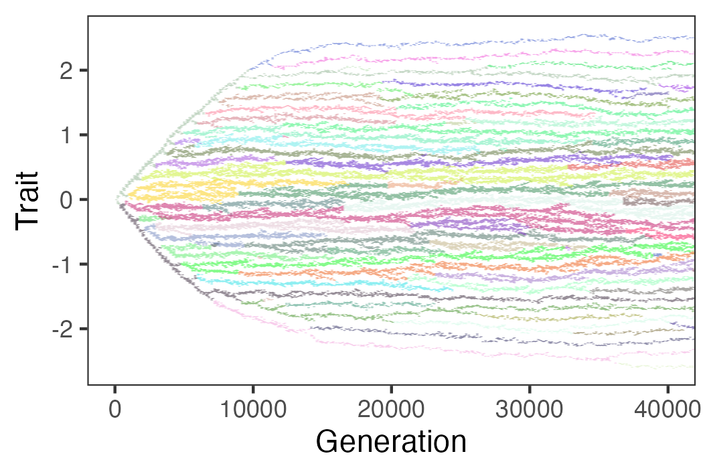

# comrad: A more mechanistic approach to diversity-dependent diversification

| Branch        |                                                                                                                               |                                                                                                               |
|------------------------|------------------------|------------------------|
| `master`      |       |            |
| `develop`     |      |          |
| `brute_force` | * |  |

*see the Installation section

### Description

`comrad` is an individual-based model of diversity-dependent diversification, where branching (and by extension, speciation), extinction and equilibrium diversity emerge from Lotka-Volterra like competition between individuals.

This package contains the algorithm for the model and functions used to run it, extract, analyse and visualise its output, including the phylogenetic tree of the community.

An overview of the model and the main features of the package can be found in the [vignette](https://github.com/TheoPannetier/comrad/blob/develop/vignettes/demo.Rmd).

The package accompanies the third chapter of my [doctoral dissertation](https://research.rug.nl/en/publications/diversity-dependence-and-the-role-of-competition-in-clade-diversi), and the corresponding manuscript, currently in prep. The functions it contains were used to produce the results and figures presented through the paper.

### Installation

I maintain two versions of the package. The default version, suitable for all applications that do not include running the simulation for large communities, can be installed from the `master` branch:

`remotes::install_github("TheoPannetier/comrad")`

An alternative version, which lives on branch `brute_force`, is more suitable for running simulations with large communities ($N > 10^4$). Indeed, because the pairwise effects of competition must be calculated at every generation, the number of calculations grows quadratically with the size of the community, and the simulation may take a very long time to complete in such cases.

A solution has been implemented by [@HHildenbrandt](https://github.com/HHildenbrandt) to address this, using parallel- (via [xsmid](https://github.com/xtensor-stack/xsimd)) and multi-processing (via [OpenMP](https://www.openmp.org/)), which greatly reduces the time the simulation takes to process the whole community.

These solutions require the code to be compiled using system-specific variables, and thus cannot be installed directly from the compiled code on `master`. If you wish to use this version, you will need to [try out and complete this section].

In case of doubt over which version is installed, the user can call `has_brute_force_opt()`, which evaluates to `FALSE` for the main version and to `TRUE` for the `brute_force` option.

### Contributing / Bug report / Support

Please open an issue (preferred), or drop me a message at [theo@pannetier.nl](theo@pannetier.nl).
